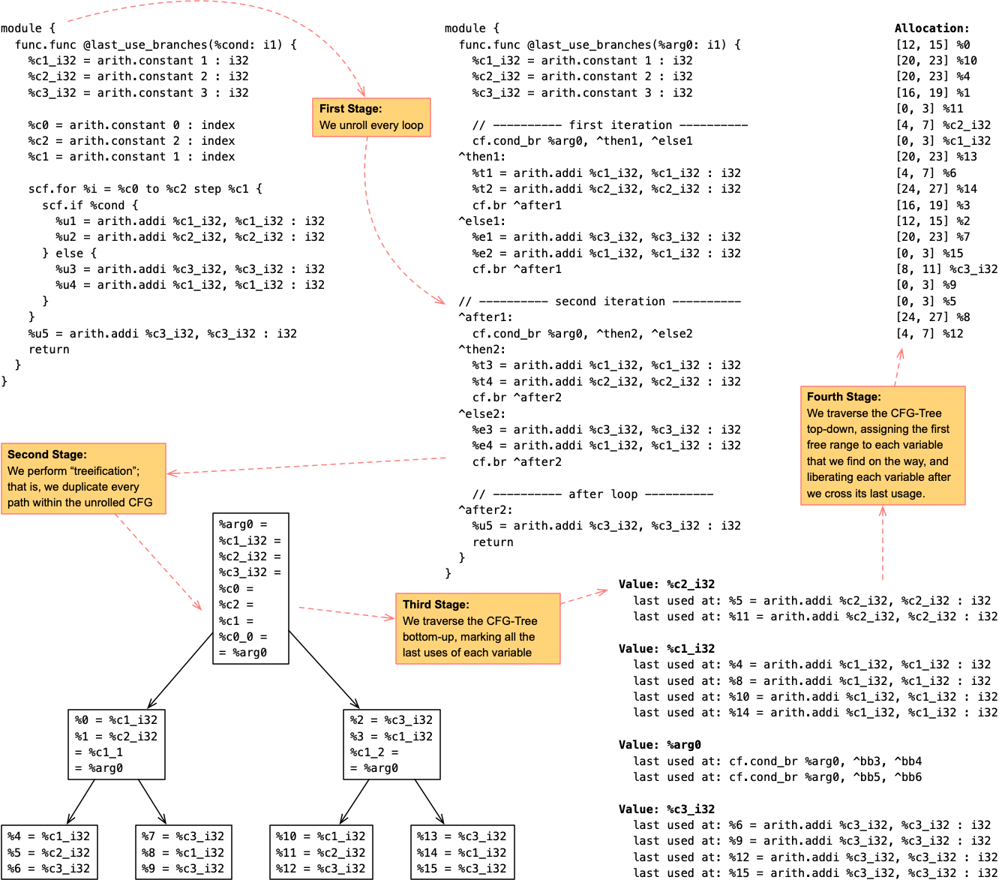
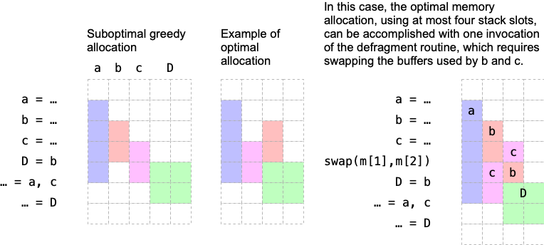

<p align="center">
  </br>
</p>

Marid is an MLIR-based static analysis and transformation framework for reasoning
about **boundedness**, **control flow structure**, and **memory allocation**
in programs with statically predictable behavior.

Marid performs memory allocation via a **tree-scan algorithm** over a tree-shaped
control-flow graph derived from structured MLIR programs.

</br>

For evaluation, Marid provides three versions of memory allocation:

* **Plain**: Always allocates a fresh stack interval for each value or buffer.
* **Tree-Scan**: Reuses stack space by freeing memory at last uses.
* **Tree-Scan Defrag**: Extends tree-scan with stack defragmentation to minimize
  peak stack size when buffer sizes differ.

---

## Building

```bash
mkdir build
cd build
cmake ..
make
````

---

## Usage

```bash
./bin/marid-opt program.mlir
```

The tool prints:

* diagnostics from the boundedness checker,
* a detailed memory allocation report,
* followed by the (unchanged) transformed MLIR module.

---

## Pipeline Overview

Marid implements an MLIR-based transformation pipeline that converts structured
programs into a **Tree-shaped Control Flow Graph (CFG)** and then performs
**deterministic stack memory allocation**.

By expanding all loops and duplicating control-flow continuations,
Marid ensures that every possible execution path is represented by its own
linear sequence of operations ending in a unique `return`.

The pipeline consists of four stages:

1. **Analysis**: Verify that the program is constant-bounded.
2. **Expansion**: Unroll all loops with static trip counts.
3. **Treeification**: Eliminate join points by duplicating control flow.
4. **Memory Allocation**: Assign fixed stack locations to all values.

---

## 1. Constant Boundedness Analysis

Before any transformation, Marid verifies that the program is **constant-bounded**.
Intuitively, this means that both execution time and the number of execution paths
are statically known.

### Rules

* No `scf.while` loops.
* `scf.for` loops must have:

  * constant lower bounds,
  * constant upper bounds,
  * constant step sizes.

### Pseudo-code

```python
def check_constant_boundedness(module):
    for op in module:
        if op is scf.while:
            return False
        
        if op is scf.for:
            if not (is_constant(op.lb) and
                    is_constant(op.ub) and
                    is_constant(op.step)):
                return False
    return True
```

---

## 2. Loop Expansion

Once a program is proven constant-bounded, Marid fully unrolls all `scf.for` loops.
Each loop body is cloned once per iteration, replacing the induction variable with
the corresponding constant value.

### Pseudo-code

```python
def expand_loops(module):
    for for_op in module.walk_post_order(scf.for):
        trip_count = (for_op.ub - for_op.lb) / for_op.step
        
        for i in range(trip_count):
            iv_value = for_op.lb + i * for_op.step
            clone_body(for_op.body, {for_op.iv: iv_value})
        
        for_op.erase()
```

---

## 3. Treeification

After loop expansion, structured conditionals (`scf.if`) may still introduce
join points, yielding a DAG-shaped CFG.

Treeification eliminates join points by **duplicating continuation code** into
each branch, producing a strict tree-shaped CFG.

After treeification:

* The CFG has no join points.
* Each block has exactly one predecessor (except the entry).
* Each `return` corresponds to a unique execution path.

### Pseudo-code

```python
def treeify(func):
    while func.contains_join():
        if_op = select_if_with_join(func)
        continuation = split_after(if_op)

        then_path = clone(if_op.then_region, continuation)
        else_path = clone(if_op.else_region, continuation)

        replace_if_with_branches(if_op, then_path, else_path)
```

---

## 4. Tree-Scan Memory Allocation

After treeification, each execution path is a straight-line program.
This enables a simple **tree-scan stack allocator**, inspired by classic
tree-scan register allocation.

### Core Idea

* Traverse operations in program order.
* Allocate stack space for values at definition.
* Free stack space at the **last use** of each value.
* Reuse freed stack intervals whenever possible.

The allocator maintains:

* `active`: currently live values mapped to stack intervals.
* `freeList`: a list of freed stack intervals.
* `nextOffset`: the end of the currently used stack prefix.
* `globalMaxStackSize`: the maximum stack size observed across all paths.

### Tree-Scan Allocation Pseudo-code

```python
def allocate_block(block, state):
    for op in block:
        # Free operands at last use
        for v in op.operands:
            if is_last_use(v, op):
                free(state, state.active[v])
                del state.active[v]

        # Allocate results
        for r in op.results:
            size = sizeof(r)
            interval = allocate_interval(state, size)
            state.active[r] = interval

            # Immediately free values with no uses
            if r.has_no_uses():
                free(state, interval)
                del state.active[r]
```

---

## 5. Tree-Scan with Defragmentation

The basic tree-scan allocator is optimal when all stack slots have equal size.
However, when values have **different sizes**, fragmentation may prevent reuse
of available space, even when the total free memory is sufficient. The figure below illustrates the issue:

</br>

To address this shortcoming, Marid implements **stack defragmentation**.

### When Defragmentation Happens

Defragmentation is triggered when:

* there is some free memory, and
* allocating a new value would increase the maximum stack size observed so far.

In that case, the allocator compacts all live intervals toward offset zero,
creating one contiguous free region at the top of the stack.

### Allocation with Defragmentation (High-Level)

```python
def allocate_interval(state, size):
    if has_contiguous_free(state, size):
        return allocate_from_free_list(state, size)

    if total_free_memory(state) > 0 and \
       state.next_offset + size > global_max_stack_size:
        defragment(state)

    return allocate_from_top(state, size)
```

### Defragmentation Pseudo-code

```python
def defragment(state):
    # Sort active intervals by offset
    active = sort_by_offset(state.active)

    new_offset = 0
    for (value, interval) in active:
        if interval.offset != new_offset:
            move_memory(value, new_offset)
        interval.offset = new_offset
        new_offset += interval.size

    state.next_offset = new_offset
    state.free_list.clear()
```

Conceptually, defragmentation performs a sequence of logical memory moves
(using a temporary buffer if needed), ensuring that:

* all live values are tightly packed,
* the stack prefix is fully utilized,
* and future allocations occur at the smallest possible offset.

### Statistics

The allocator reports:

* number of defragmentation events,
* number of logical moves,
* total bytes copied.

This makes the cost of defragmentation explicit and measurable.

---

## CFG Properties After the Pipeline

After the full Marid pipeline, the resulting MLIR module satisfies:

1. **No Loops**: The CFG is acyclic.
2. **No Join Points**: Each block has at most one predecessor.
3. **Path Isolation**: Each `return` corresponds to a unique execution trace.
4. **Static Memory Layout**: All values have fixed, statically known stack locations.